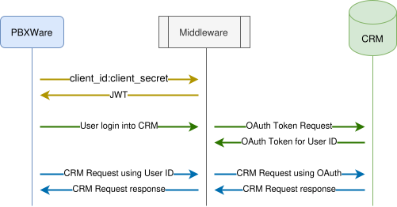

# CRM Middleware Technical Documentation

This covers the technical requirements for implementing
a CRM Middleware API compliant to Bicom Systems Custom
CRM Middleware.

## Communication between PBX and CRM through Middleware

### Connect PBX to Middleware

To ensure proper interaction between your middleware application and PBXware's
services, it must follow the specified communication process.

When registering your custom CRM within the PBXware interface, user needs
to provide a Client ID and API Key (Client Secret). PBXware will
use these to authorize itself with the middleware using **Basic Auth**.

In response PBXware must receive a valid JWT token which it will from
now on use to authorize itself with the middleware. This access token
must be handled per client, so each JWT token should contain Client ID
for which it has been issued.

This JWT will be used by PBXware to authorize itself with your middleware.

The registered Client ID **must be unique** within PBXware (both tenants and instances) and no
other custom CRM integration can use that one. The API key is simply
the authorization key you've set in your middleware.

### Connect Middleware to CRM

Connecting your Middleware with the desired CRM should be simple and follow the given CRM's auth method, either **OAuth** or **Basic Auth**.

Login will be initiated by a user on your PBXware (an extension). Middleware should take this **User ID** and:

- **For OAuth**: generate an OAuth token on the CRM side. The generated token should be stored in the Middleware and used to authorize future requests made by that User ID.

- **For Basic Auth**: validate the user's credentials (username and password) against the CRM. These credentials are then used to authenticate future requests made by that User ID.

### Forwarding requests

When receiving a request Middleware will receive a User ID header sent
by PBXware to differentiate which User is making a request.

Handle the CRM's response in any way you see fit. PBXware should receive
a response for the request it made with a HTTP status code.



## OAuth2 Callback

For OAuth2 Authorization Code implementations, your middleware must expose a callback URL that the OAuth provider redirects to after user authorization. The callback path is implementation-defined; in the reference example it is `/salesforce/user/callback/code`.

### Expected

The OAuth provider callback must contain `state` which is base64-encoded JSON string containing `redirect_uri`, `client_id` and `user_id`, as set by the `GET /api/v1/auth/login_url` endpoint.

OAuth token exchanged with authorization code needs to be stored against `client_id` and `user_id`, by which user is identified on each request. Callback must redirect to the `redirect_uri` extracted from `state`.

### Response

Redirect to the `redirect_uri` extracted from `state` with:
- `success`: a boolean indicating whether the operation (generate and store user token) was successful
- `state`: the original `state` value (URL-encoded)

**Example:**
```
https://pbx.example.com/callback?success=true&state=<encoded_state>
```

On failure, redirect with `success=false`.

## Access Token

This will generate the JWT token for application using Basic auth.
To authorize your app with PBXware, it's required to exchange a
JWT token using Basic auth.

This section represents the endpoint itself while the technical
side of process is explained in the [Connect PBX to Middleware](#connect-pbx-to-middleware) section.

All endpoints (except this one) should expect header with `Authorization: Bearer <JWT>` that should be used to
authenticate PBXware and identify Client application. 

### Route

`GET /api/v1/token`

### Expected

Basic auth using the Client ID and API Key (Client Secret) configured in PBXware.

### Response

```json
{
    "token": "<JWT_TOKEN>"
}
```

# Auth Endpoint Group

## Auth

Endpoint to generate OAuth login URI. Applies to CRM integrations using `auth_method: oauth2`.

### Route

`GET /api/v1/auth/login_url`

### Expected

Headers:
```
Authorization: Bearer <JWT>
user_id: <User ID>
```

Query parameter containing the URI PBXware expects to be redirected to after OAuth completes:
```
    redirect_uri=<URI>
```

### Response

JSON containing redirect URI:
```json
{
    "login_url": "https://example.com/login_url?..."
}
```

## Basic Auth

Endpoint to authenticate using Basic Auth. In this method users provide username and password.
Applies to CRM integrations using `auth_method: basic-auth`.

*In our example, Salesforce integration is both exposed as `oauth2` and `basic-auth` integration, under different base paths: `/salesforce/user` and `/salesforce/direct` respectively. Both APIs have same backend for integration, except for user authentication.*

### Route

`POST /api/v1/auth/login`

### Expected

Headers:
```
Authorization: Bearer <JWT>
user_id: <User ID>
```

**Body:**

JSON containing username and password.

```json
    {
        "username": "username",
        "password": "password"
    }
```

### Response

The response always contains a JSON body with a `status` and `message` field.

**Valid credentials:**

Status code: 200 OK

```json
{
    "status": "ok",
    "message": "authorized"
}
```

**Invalid credentials:**

Status code: 401 Unauthorized

```json
{
    "status": "error",
    "message": "OAuth password: token request failed"
}
```

## Auth status

Check if the user has logged in before by checking if there exists an
OAuth token for the user - valid or expired.

### Route

`GET /api/v1/auth/status`

### Expected

Headers:
```
Authorization: Bearer <JWT>
user_id: <User ID>
```

### Response

JSON containing the current auth status of requested user:
```json
{
    "authorized": bool,
    "email": "user identifier or empty"
}
```

The `email` field contains the user's CRM username, email address, or another identifier, if available.

## User Logout

Logout procedure. Invalidates the user's authorization by deleting tokens.

### Route

`GET /api/v1/auth/logout`

### Expected

Headers:
```
Authorization: Bearer <JWT>
user_id: <User ID>
```

### Response

No response

# Config API group

## Config

Retrieves configuration to be used in PBXware to display your custom integration.

This endpoint is part of the initial setup flow and is called before the integration becomes active. Once the Client ID has been activated (which happens when [Versions](#versions) is called), this endpoint must reject further requests for that Client ID. This prevents an already-configured integration from being silently reconfigured.

As a consequence, **Client IDs must never be reused** across different systems, customers, tenants, or instances. Each integration registration requires its own unique Client ID.

### Route

`GET /api/v1/config`

### Expected

Header:
```
Authorization: Bearer <JWT>
```

### Response

JSON detailing your configuration:
```json
{
    "name": "Integration display name",
    "image": "base64 encoded .webp icon of size 240x240",
    "auth_method": "oauth2 | basic-auth | none"
}
```

## Versions

Versions of CRM API supported by your middleware.

Best practice would be to offer single version and update middleware continuously.

Calling this endpoint is the point at which a Client ID becomes active in your middleware. After this call the integration is considered fully set up: [Config](#config) will no longer accept requests for this Client ID, and all per-user object operations are open. Your implementation should enforce this transition.

### Route

`GET /api/v1/config/versions`

### Expected

Header:
```
Authorization: Bearer <JWT>
```

### Response

JSON array containing all supported versions.
```json
["51", "52", "53"]
```

## Supported Objects

Objects supported by your CRM. These values will be used as `<Object Type>` in API.

### Route

`GET /api/v1/config/objects`

### Expected

Header:
```
Authorization: Bearer <JWT>
```

### Response

JSON array containing all supported objects
```json
["Account", "Contact", "Lead"]
```

## Custom Fields Update

Object Descriptions by default are considered as open for extending definitions middleware provided by default.
All changes to custom fields are sent to middleware in case these custom fields need to be handled
separately from default model.

In case middleware doesn't want to handle custom fields, each Object Description should indicate
that it can't be extended.

### Route

`POST /api/v1/config/custom-fields`

### Expected

Header:
```
Authorization: Bearer <JWT>
```

This endpoint will receive all defined custom fields from PBXware in a
JSON array storing each Object's definition.

For example, this could be what PBXware will send to your middleware:

```json
{
    "Account": [
        {
            "id": "custom_test",
            "type": "string",
            "logic_type": "other",
            "edit_type": "text"
        },
        {
            "id": "custom_test_second",
            "type": "string",
            "logic_type": "other",
            "edit_type": "text"
        }
    ],
    "Contact": [
        {
            "id": "custom_test",
            "type": "string",
            "logic_type": "other",
            "edit_type": "text"
        }
    ],
    "Lead" : []
}
```

Best way to handle this is to completely replace all custom field
entries on each endpoint trigger.

# Object API group

## Describe Object

This endpoint is used in our system to get an object's data model.

### Route

`GET /api/v1/object/describe/<Object Type>`

### Expected

Header:
```
Authorization: Bearer <JWT>
```

URL with object type specified.

### Response

JSON data model of the requested object type:

```json
{
    "id": "Account",
    "label": "Account",
    "extendable": true,
    "fields": [
        {
            "id": "Id",
            "label": "Id",
            "type": "string",
            "logic_type": "id",
            "edit_type": "text",
            "visibility": {
                "view": false,
                "create": false,
                "edit": false,
                "required": false,
                "editable": false
            },
            "relation": null,
            "list": null,
        },
        {
            "id": "Parent",
            "label": "Parent Company",
            "type": "to_one",
            "logic_type": "other",
            "edit_type": "association",
            "visibility": {...},
            "relation": {
                "object": "Account",
                "fields": {
                    "id": "Id",
                    "value": "Name"
                }
            },
            "list": null,
        },
        {
            "id": "Industry",
            ...
            "edit_type": "list",
            "visibility": {...
            },
            "relation": null,
            "list": {
                "multiselect": true,
                "default": {
                    "id": "Agriculture",
                    "value": "Agriculture"
                },
                "items": [
                    {
                        "id": "Agriculture",
                        "value": "Agriculture"
                    },
                    {
                        "id": "Apparel",
                        "value": "Apparel"
                    },
                    ...
                ]
            },
        }
    ]
}
```

## Create Object

Endpoint to create a given Object on your CRM.

### Route

`POST /api/v1/object/<Object Type>`

### Expected

Headers:
```
Authorization: Bearer <JWT>
user_id: <User ID>
```

JSON Body with object description. All fields marked as required must be provided.

For example:

```json
{
    "FirstName": "John",
    "LastName": "Doe",
    "Email": "djhon@example.com",
    "Phone": "443-111-4565",
    "MobilePhone": "987-654-3210",
    "Title": "Senior Vice Manager",
    "Department": "Dunder Mifflin Inc.",
    "MailingCity": "Los Angeles",
    "MailingState": "CA",
    "MailingPostalCode": "75270",
    "MailingCountry": "USA"
}
```

> Field names here must match your Object data model description

### Response

```json
{
    "id": "xxxxxxxxxxxxxxxxx",
    "type": "Contact",
    "last_modified_timestamp": 1716569790
}
```

## Get Object

Fetch the entire object, with all defined fields, from CRM into our application.

### Route

`GET /api/v1/object/<Object Type>/<Object ID>`

### Expected

Headers:
```
Authorization: Bearer <JWT>
user_id: <User ID>
```

URL with Object Type and Object ID specified.

An optional `fields` query parameter may be sent containing a comma-separated list of field names. This is a hint derived from the object's data model definition in PBXware -- the field list in PBXware and the middleware should always be kept in sync, so the response should always contain the same fields. If they ever diverge, the `fields` parameter indicates which fields PBXware actually expects in the response.

### Response

JSON model of the given object with defined fields.

```json
{
    "Account": {
        "Id": "xxxxxxxxxxxxxxxxx",
        "Name": "Butter Smith",
    },
    "BillingStreet": null,
    "Description": null,
    "Fax": null,
    "Id": "xxxxxxxxxxxxxxxxx",
    "Industry": null,
    "LastModifiedDate": 1716569790,
    "Owner": {
        "Id": "yyyyyyyyyyyyyyyyyy",
        "Name": "Company Owner",
    },
    "Parent": null,
    "Phone": "38762123456",
    "Rating": null,
    "Website": null
}
```

## Update Object

This should work in the way similar to Create Object, but will
only update the fields of existing objects.

### Route

`PUT /api/v1/object/<Object Type>/<Object ID>`

### Expected

Headers:
```
Authorization: Bearer <JWT>
user_id: <User ID>
```

JSON containing the fields to be updated.

For example:

```json
{
  "Phone": "443-111-44656"
}
```

### Response

```json
{
    "id": "xxxxxxxxxxxxxxxxx",
    "type": "Contact",
    "last_modified_timestamp": 1716569790
}
```

## Search

Required endpoint for searching objects within your CRM.

### Route

`GET /api/v1/search`

### Expected

Headers:
```
Authorization: Bearer <JWT>
user_id: <User ID>
```

Query parameters:

| Parameter | Required | Description |
|-----------|----------|-------------|
| `q` | Yes | The search query string |
| `search_by` | No | Search scope: `phone`, `email`, or `field` |
| `object_types` | No | Object types to search. Repeatable: `object_types=Contact` `&object_types=Lead` |
| `field` | When `search_by=field` | The specific field name to search against (requires exactly one `object_types` value) |
| `limit` | No | Maximum number of results to return |
| `phones` | No | Additional phone number representations to search by, sent alongside `search_by=phone`. PBXware may include normalized or alternative formats of the caller number. Repeatable: `phones=+14431114565` `&phones=14431114565`. Implementors may use these to broaden the phone lookup. |

For example:

```
?q=john%40example.com&search_by=email
    &object_types=Contact&object_types=Lead

?q=john%40example.com&search_by=field&field=PersonalEmail
    &object_types=Contact&limit=5
```

### Response

JSON array of matched records:

```json
[
    {
        "id": "xxxxxxxxxxxxxxxxxx",
        "type": "Contact",
        "title": "John Doe",
        "emails": ["djohn@example.com"],
        "phones": ["443-111-4565"],
        "last_modified_timestamp": 1716569790
    },
    {
        "id": "yyyyyyyyyyyyyyyyyy",
        "type": "Lead",
        "title": "John Hetfield",
        "emails": ["hetfield_john@example.com"],
        "last_modified_timestamp": 1716569800
    }
]
```

## Associations

Search for records to populate relation/association fields. Used when the user is filling in a `to_one` or `to_many` field (e.g., selecting a parent Account).

### Route

`GET /api/v1/associations`

### Expected

Headers:
```
Authorization: Bearer <JWT>
user_id: <User ID>
```

Requires exactly one object type. The `fields` parameter specifies which two CRM fields to use as the record ID and display label.

| Parameter | Required | Description |
|-----------|----------|-------------|
| `q` | Yes | The search query string |
| `object_type` | Yes | Exactly one object type to search |
| `fields` | Yes | Two comma-separated field names: `<id_field>,<label_field>` |

### Response

JSON array of matching records:

```json
[
    {
        "id": "xxxxxxxxxxxxxxxxxx",
        "type": "Account",
        "title": "Acme Corp",
        "last_modified_timestamp": 1716569790
    }
]
```

## Create Task

### Route

`POST /api/v1/create-task`

### Expected

Headers:
```
Authorization: Bearer <JWT>
user_id: <User ID>
```

Body describing the task:

```json
{
    "name": "string",
    "conversation_id": "string",
    "tenant_code": "string",
    "ext": "string",
    "customer_id": "string",
    "answered": int,
    "duration": int64,
    "subject": "string",
    "description": "string",
    "channel": "string(voice | sms | email | livechat | facebook | whatsapp)",
    "conversation_finished": bool,
    "conversation_start_time": int64,
    "object_type": "string",
    "object_id": "string"
}

```

### Response

`201 Created` on success. Any other status code indicates failure.

## Integration Deletion

Handle complete deletion of your custom integration. This depends on your implementation.

### Route

`DELETE /api/v1/integration`

### Expected

Header:
```
Authorization: Bearer <JWT>
```

Calling this endpoint is sufficient.

### Response

HTTP Status code

---

# Routing Integration

The Routing Integration enables PBXware to look up a CRM record during an active call and route the caller based on the result. Already described CRM Middleware API, once implemented, is fully supported in Routing, so Custom Integrations provided with Middleware API are by default available in Routing.

Routing itself, besides Custom Integrations, allows use of Custom Source endpoints in routing, that don't require full implementation of middleware. HTTP endpoint for Custom Source doesn't have clear API requirement, as request itself is highly customizable through PBXware.

## Custom Source

Since our main example for Custom integration middleware is Salesforce, example for Custom Source is also Salesforce, as it shows clear difference between Custom Integration and Custom Source for Routing. In our example, `client_credentials` are used to authenticate with Salesforce and we imposed simple restriction that only allows requests that have valid **Client ID** with status `ROUTING`.

## Endpoint

The endpoint path, HTTP method, and parameter names are all implementation-defined. There are no restrictions on how the route is structured. What matters is the semantic contract described below.

## Request Parameters

The request carries four parameters. They can be sent as query string parameters or as a JSON body -- either is acceptable. The parameter names are chosen by the implementor; the semantic roles are fixed.

| Semantic role | Required | Description |
|---|---|---|
| **Customer ID** | Yes | The caller's phone number or other identifier. Used to search for a matching record, typically by querying phone fields. |
| **Response fields** | Yes | A comma-separated list of object field names. The response needs to include exactly these fields from the matched record. |
| **Customer input** | No | A value the caller entered during the call (e.g. an account number or PIN). When provided, it is used as the lookup value instead of the caller's phone number. Requires **target field** to also be set. |
| **Target field** | Conditional | Field to match **customer input** against. Required when **customer input** is present. |

Semantic role of parameters doesn't impose obligation to use them in any way, but rather to represent what these values mean for PBXware call routing.

## Response

A JSON object containing the matched record. The fields returned are those requested via the **response fields** parameter.

If no match is found, the response indicates that no record was located (exact status code and body are implementation-defined).

Important: In order for routing to work as expected for this endpoint, it's only requirement for record(s) in response data to have fields that PBXware requested with *Response fields* semantic role.

## Example

The reference implementation uses the following parameter names and endpoint structure:

- Endpoint: `POST /custom-source/routing/{object_type}` where `{object_type}` is the Salesforce CRM object type (e.g. `Contact`, `Lead`)
- `number` -> **customer ID**
- `api_fields` -> **response fields**
- `caller_input` -> **customer input**
- `input_target_field` -> **target field**

### Example request:

### Route

`POST /custom-source/routing/Lead`

### Expected

`X-Client-Id` header and proper Object Type defined in the URL.

```json
{
    "number": "443-111-4565",
    "api_fields": "Id,FirstName,LastName,Phone,Email",
    "caller_input": "ACC-00123",
    "input_target_field": "AccountNumber__c"
}
```

### Example response

```json
{
    "Id": "xxxxxxxxxxxxxxxxx",
    "FirstName": "John",
    "LastName": "Doe",
    "Phone": "443-111-4565",
    "Email": "john@example.com"
}
```
